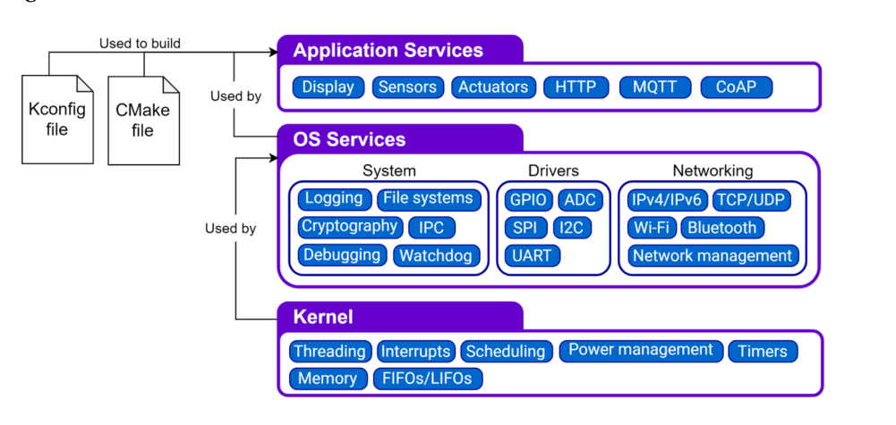
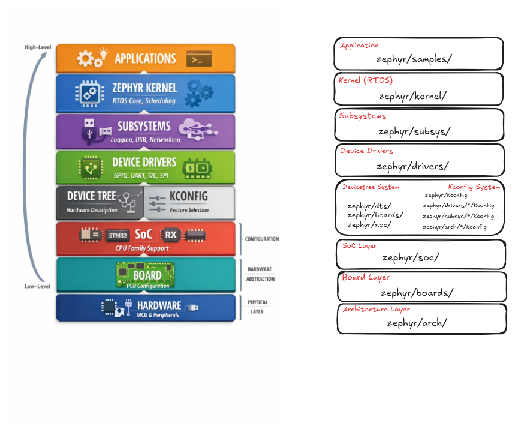
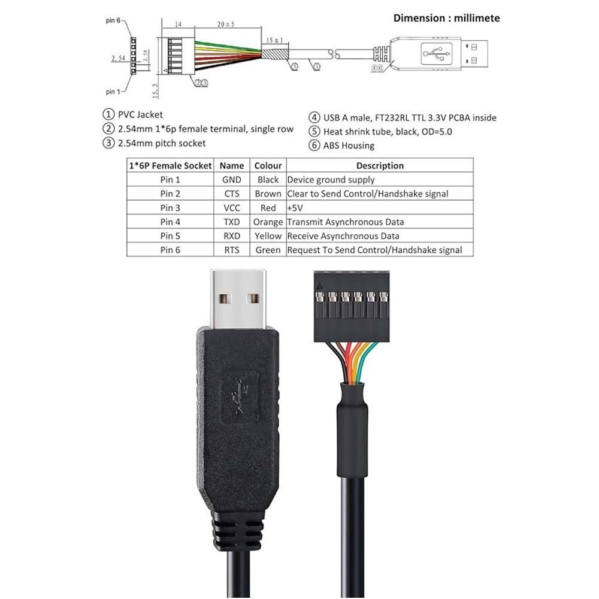

# West (Project Manager)
West is Zephyr RTOS’s meta-tool for project management. It wraps Git and build commands to manage multi-repository Zephyr workspaces. West initializes the workspace, fetches modules, builds applications, and flashes firmware to boards. Key commands include west init, west update, west build, and west flash. It reads a manifest file to know which repositories and revisions to use. In short, West is the control layer that coordinates source sync, build, and deployment for Zephyr projects.

West manages the whole Zephyr workspace. It knows:
- where the code lives
- which board you’re building for
- how to start the build and flash

You tell West: “Build this for stm32f4_disco” — it coordinates everything.

# CMake (Architect/Planner)
CMake is a cross-platform build system generator. It reads configuration files (CMakeLists.txt) that describe your project’s source files, dependencies, compiler options, and targets. From this, it generates native build files such as Makefiles or Ninja files. You then use tools like make or ninja to compile the code. CMake does not build directly — it prepares the build system. It is widely used in C/C++ projects, including Zephyr, to keep builds portable and reproducible across environments.

CMake reads CMakeLists.txt and creates the detailed build plan:
- which source files to compile
- which libraries to link
- which flags to use

It generates the actual build instructions (Makefiles or Ninja files).

# Make (Worker)
Make is a build automation tool that compiles and links programs based on rules defined in a Makefile. The Makefile lists targets, source files, dependencies, and commands to build them. Make checks file timestamps and rebuilds only what changed, saving time. It runs compiler and linker commands in the correct order automatically. It is commonly used for C/C++ and embedded projects. In modern flows, tools like CMake often generate Makefiles, and then Make executes the actual build steps.

Make follows the plan from CMake and does the real work:
- compiles code
- links binaries
- rebuilds only changed files

# Block Diagram

# Zephyr Layers

# External USB-TTL converter

# Resources
1. Free Videos on Zephyr: https://www.classcentral.com/subject/zephyr
2. Join Zephyr Discord Channel: 
3. https://interrupt.memfault.com/blog/practical_zephyr_basics
4. ESP32 with Zephyr RTOS: https://www.youtube.com/watch?v=Z_7y_4O7yTw&list=PLEQVp_6G_y4iFfemAbFsKw6tsGABarTwp
