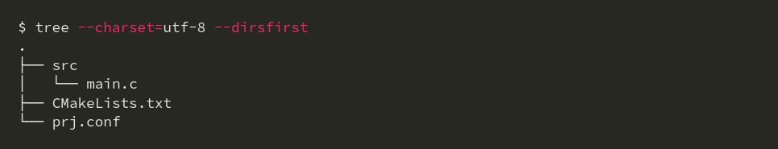

# Basic information

**Host OS:** Ubuntu 22.04

**Linux version:** Linux vivekyadav 6.14.0-37-generic #37~24.04.1-Ubuntu SMP PREEMPT_DYNAMIC Thu Nov 20 10:25:38 UTC 2 x86_64 x86_64 x86_64 GNU/Linux

**zephyrproject location:** /home/vivek/zephyrproject

**zephyr-sdk location:** /home/vivek/zephyr-sdk-0.17.4

**my-workspace:** /home/vivek/workspace/zephyer-ws/zephyrTestProject/workspace/my-project

**Online-resource:** https://docs.zephyrproject.org/latest/boards/st/stm32f4_disco/doc/index.html


# Getting Started Guide (Ubuntu)
**Online resource:** https://docs.zephyrproject.org/latest/develop/getting_started/index.html
## Update OS
```
sudo apt update
sudo apt upgrade
```
## Install dependencies
```
sudo apt install --no-install-recommends git cmake ninja-build gperf \
  ccache dfu-util device-tree-compiler wget python3-dev python3-venv python3-tk \
  xz-utils file make gcc gcc-multilib g++-multilib libsdl2-dev libmagic1

sudo apt-get install --no-install-recommends git cmake ninja-build gperf \
  ccache dfu-util device-tree-compiler wget \
  python3-dev python3-pip python3-setuptools python3-tk python3-wheel xz-utils file \
  make gcc gcc-multilib g++-multilib libsdl2-dev libmagic1
```

**NOTE:** There could be some other dependencies. Google it and download them. When you encounter the error.

## Get Zephyr and install Python dependencies
```
python3 -m venv ~/zephyrproject/.venv
source ~/zephyrproject/.venv/bin/activate
pip install west
west init ~/zephyrproject
cd ~/zephyrproject
west update
west zephyr-export
west packages pip --install
```
## Install the Zephyr SDK
```
cd ~/zephyrproject/zephyr
west sdk install
```

# A skeleton freestanding application
1. Create a project folder anywhere in file system
2. Create folder like the picture as shown below.


3. Update CMakeLists.txt file
```
vivek@vivekyadav:~/workspace/zephyer-ws/zephyrTestProject/workspace/my-project$ cat CMakeLists.txt 
cmake_minimum_required(VERSION 3.20.0)

set(BOARD stm32f4_disco)
find_package(Zephyr REQUIRED HINTS $ENV{ZEPHYR_BASE})

project(
    EmptyApp
    VERSION 0.1
    DESCRIPTION "Empty zephyr application."
    LANGUAGES C
)

target_sources(
    app
    PRIVATE
    src/main.c
)
```

4. Update src/main.c file
```
#include <zephyr/kernel.h>

int main(void)
{
    while (1)
    {
        k_msleep(100U); // Sleep for 100 ms.
    }
}
```
# Load Zephyr environment
5. Goto **zephyrproject location:** /home/vivek/zephyrproject
6. Source virtual environment : 
```
    source zephyrporject/.venv/bin/activate
    source zephyrporject/zephyr/zephyr-env.sh
```

# Build
7. Goto your workspace : ~/workspace/zephyer-ws/zephyrTestProject/workspace/my-project
8. west build -b stm32f4_disco

```
[152/152] Linking C executable zephyr/zephyr.elf
Memory region         Used Size  Region Size  %age Used
           FLASH:       17568 B         1 MB      1.68%
             RAM:        4544 B       128 KB      3.47%
           SRAM0:          0 GB       128 KB      0.00%
            DTCM:          0 GB        64 KB      0.00%
        IDT_LIST:          0 GB        32 KB      0.00%
Generating files from /home/vivek/workspace/zephyer-ws/zephyrTestProject/workspace/my-project/build/zephyr/zephyr.elf for board: stm32f4_disco/stm32f407xx
(.venv) vivek@vivekyadav:~/workspace/zephyer-ws/zephyrTestProject/workspace/my-project$
```

After sucessfull build. You will notice a `build` folder inside your `my-project` directory.
Look for `zephyr.elf` file.

# Flash stm32f4_desco board
west flash --runner openocd

# Blink Led now.
Update `src/main.c` file

```
#include <zephyr/kernel.h>
#include <zephyr/drivers/gpio.h>
#include <zephyr/devicetree.h>

/* Get LED node from devicetree alias */
#define LED_NODE DT_ALIAS(led0)

#if !DT_NODE_HAS_STATUS(LED_NODE, okay)
#error "Board does not define led0 alias"
#endif

static const struct gpio_dt_spec led = GPIO_DT_SPEC_GET(LED_NODE, gpios);

int main(void)
{
    int ret;

    if (!gpio_is_ready_dt(&led)) {
        return 0;
    }

    ret = gpio_pin_configure_dt(&led, GPIO_OUTPUT_ACTIVE);
    if (ret < 0) {
        return 0;
    }

    while (1) {
        gpio_pin_toggle_dt(&led);
        k_msleep(500);
    }
}

```
